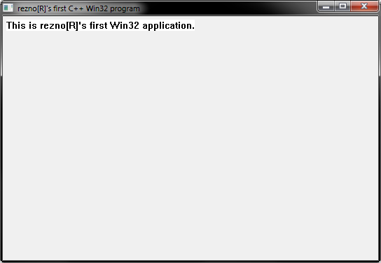
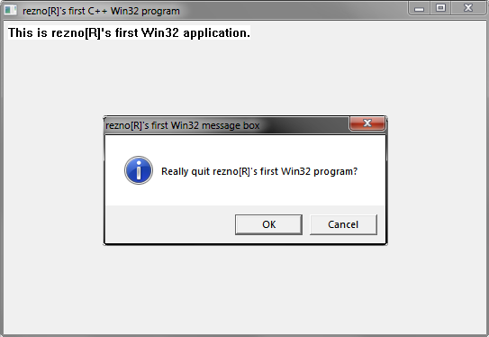

# Reznor's first Win32 program written in CodeBlocks and C++
> Simple Windows program made from the official Microsoft tutorial about creating first Win32 program.

## General info
My first Windows GUI application written in C++ using the official Win32 API according to the official Microsoft tutorial. It's a one simple window with the title and text "This is rezno[R]'s first Win32 application.". After clicking the X button the program shows an OK/Cancel dialog box "Really quit rezno[R]'s first Win32 program?".
The source code is extensively commented with all the basic info about what every piece of code does in it, as I've did it for myself to learn how Windows programs work.

## Technologies
* C++
* CodeBlocks (IDE)
* Win32 API

## Screenshots

## Contact
[ReznoRMichael](https://github.com/ReznoRMichael) - 2019